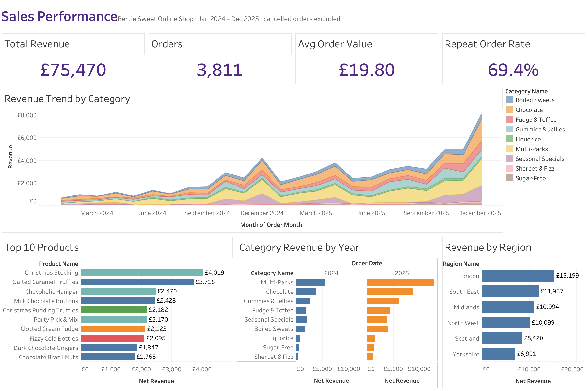
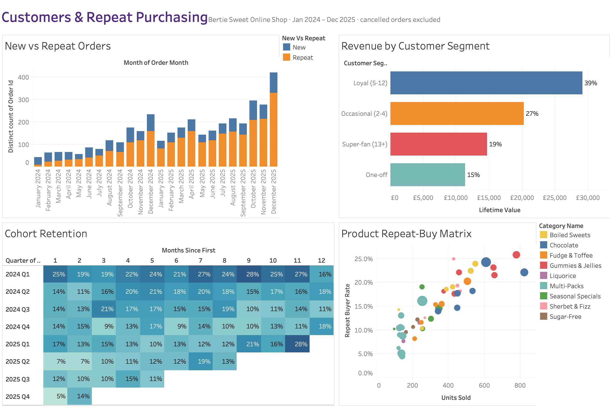

# 🍬 Bertie Sweet Online Shop: SQL Database & Sales Analytics


An end-to-end data project for a fictional UK online sweet shop. I designed a **normalised (3NF) relational database** from a conceptual ERD, loaded it with two years of realistic sales data, answered business questions with **complex SQL**, and built an **interactive Tableau dashboard** that tracks product sales performance, category revenue trends and repeat purchasing behaviour.

> 🔗 **Live dashboard:** _add your Tableau Public link here_



---

## 📌 Business problem

Bertie Sweets sells single bags of sweets and curated multi-packs online, fulfilled from regional distribution centres across the UK. The business needed answers to:

1. **Which products and categories drive revenue**, and how does that change through the year?
2. **Are customers coming back?** Who are the loyal customers and how much are they worth?
3. **Do promotions work?** Do sweets sell faster when they are on offer?
4. **Where is stock running low** relative to recent demand?

---

## 🗂️ Repository structure

```
bertie-sweet-shop/
├── sql/
│   ├── 01_schema.sql              # 23 tables, PK/FK/CHECK constraints, indexes
│   ├── 02_seed_data.sql           # generated sample data (~3.9k orders, 10k order lines)
│   ├── 03_views.sql               # reporting layer – 6 analytical views
│   └── 04_analysis_queries.sql    # 15 business questions answered in SQL
├── scripts/
│   ├── generate_seed_data.py      # reproducible synthetic data generator
│   ├── export_for_tableau.sql     # exports views → CSV for Tableau
│   └── build_tableau_workbook.py  # generates the Tableau workbook (.twb) from the CSVs
├── tableau/
│   ├── bertie_sweets_dashboard.twbx  # packaged Tableau workbook (data included)
│   ├── bertie_sweets_dashboard.twb   # same workbook as plain XML (generated)
│   ├── dashboard_*.png            # dashboard screenshots
│   ├── data/                      # CSV extracts used by the dashboard
│   └── dashboard_guide.md         # sheets, calculated fields, layout
├── docs/
│   ├── erd_original.jpg           # original conceptual ERD
│   └── schema_erd.md              # final 3NF ERD (Mermaid)
└── README.md
```

---

## 🧱 Database design

The project started from a conceptual ERD ([`docs/erd_original.jpg`](docs/erd_original.jpg)) covering regions, warehouses, distribution centres, sweets, multi-packs, offers, customers, shopping lists, baskets, and standard, special and standing orders.

While turning it into a physical schema I **normalised it to Third Normal Form**. The final model is in [`docs/schema_erd.md`](docs/schema_erd.md).

### Key design decisions

| Issue in the conceptual model | Fix in the final schema | Why |
|---|---|---|
| `Sweet` carried `order_number`, `shopping_list_id`, `offer_id` FKs | Moved to junction tables: `order_item`, `shopping_list_item`, `sweet_offer` | A product belongs to *many* orders/lists/offers, so a single FK column can't model M:N (1NF/2NF violation) |
| `total_cost`, `order_total` stored on rows | Calculated in views (`vw_order_summary`) | Derived values cause update anomalies (3NF) |
| `sweet_available_quantity` on `Sweet` and `Multi_Pack` | New `stock` table keyed by **(distribution centre, sweet)** | Stock is a fact about a sweet *at a location* |
| `customer_name` used as the primary key | Surrogate `customer_id` + `UNIQUE` username/email | Names aren't unique or stable |
| `Payment_Details` stored the full card number | `payment_method` stores a token + last 4 digits only | PCI-DSS: never store full card numbers |
| `region_id` repeated on `Distribution_Center` | Region derived via `warehouse` | Removes a transitive dependency (3NF) |
| Order lines could point to a sweet **and** a multi-pack | `CHECK (num_nonnulls(sweet_code, multi_pack_id) = 1)` | Exactly one product type per line |

**Intentional "denormalisation":** `order_item.unit_price` is stored even though `sweet.unit_price` exists. It records the **price at the time of sale**. A 5% price rise on 1 Jan 2025 shows why this matters: historic revenue stays correct.

**Integrity features:** primary/foreign keys, `UNIQUE`, `CHECK` constraints (prices > 0, valid statuses, date ordering), `ON DELETE CASCADE` on child tables, and indexes on all FK and date columns used for filtering.

---

## 🔍 SQL analysis highlights

[`sql/04_analysis_queries.sql`](sql/04_analysis_queries.sql) contains 15 documented queries. Techniques used:

| Technique | Where |
|---|---|
| Multi-table `JOIN`s (up to 6 tables), `LEFT JOIN`s, self-join | Q2, Q10, Q13 |
| CTEs (`WITH`) | Q1, Q3, Q11, views |
| Window functions: `RANK`, `ROW_NUMBER`, `LAG`, running totals, moving averages | Q3, Q4, `vw_order_summary`, `vw_monthly_category_revenue` |
| Scalar, correlated & `EXISTS` subqueries | Q8, Q9, Q11 |
| `FILTER` conditional aggregation, pivoting | Q1, Q5, Q14, Q15 |
| `ROLLUP` / `GROUPING()` subtotals | Q1, Q12 |
| `PERCENTILE_CONT` (median) | Q6 |
| Cohort retention analysis | `vw_cohort_retention`, Q15 |

<details>
<summary><b>Example: best-selling product in every category (CTE + window function)</b></summary>

```sql
WITH ranked AS (
    SELECT category_name,
           product_name,
           SUM(net_revenue) AS revenue,
           RANK() OVER (PARTITION BY category_name ORDER BY SUM(net_revenue) DESC) AS rnk
    FROM vw_order_line_sales
    WHERE order_status <> 'cancelled'
    GROUP BY category_name, product_name
)
SELECT category_name, product_name, revenue
FROM ranked
WHERE rnk = 1
ORDER BY revenue DESC;
```
</details>

<details>
<summary><b>Example: repeat purchase sequence per customer (ROW_NUMBER + LAG)</b></summary>

```sql
SELECT order_id,
       customer_id,
       order_date,
       ROW_NUMBER() OVER (PARTITION BY customer_id ORDER BY order_date)               AS customer_order_seq,
       order_date - LAG(order_date) OVER (PARTITION BY customer_id ORDER BY order_date) AS days_since_prev_order
FROM customer_order;
```
</details>

<details>
<summary><b>Example: promotion effectiveness (EXISTS against time-boxed offers)</b></summary>

```sql
EXISTS (SELECT 1
          FROM sweet_offer so
         WHERE so.sweet_code = oi.sweet_code
           AND o.order_date BETWEEN so.offer_start_date AND so.offer_end_date) AS during_offer
```
</details>

---

## 📊 Tableau dashboard

The views in [`sql/03_views.sql`](sql/03_views.sql) are the dashboard's data sources, so the business logic stays in SQL.

| View | Grain | Powers |
|---|---|---|
| `vw_order_line_sales` | order line | product & category sales, regional split |
| `vw_order_summary` | order | KPIs, AOV, new vs repeat orders |
| `vw_customer_summary` | customer | lifetime value, segments |
| `vw_monthly_category_revenue` | month × category | trend, MoM & YoY growth |
| `vw_product_performance` | product | league table, repeat-buyer rate |
| `vw_cohort_retention` | cohort × month | retention heat-map |

**Dashboard 1: Sales performance:** KPI tiles · revenue trend by category · top 10 products · category revenue by year · revenue by region

**Dashboard 2: Customers & repeat purchasing:** new vs repeat orders · revenue by customer segment · quarterly cohort retention heat-map · product repeat-buy matrix



Open [`tableau/bertie_sweets_dashboard.twbx`](tableau/bertie_sweets_dashboard.twbx) in Tableau Desktop or Tableau Public; the data is packaged inside. The workbook is generated by [`scripts/build_tableau_workbook.py`](scripts/build_tableau_workbook.py), so the dashboards are reproducible from code. Sheet details and calculated fields: [`tableau/dashboard_guide.md`](tableau/dashboard_guide.md)

---

## 💡 Key insights

*(from the sample dataset, Jan 2024 to Dec 2025)*

- **Strong growth:** revenue rose **~120% year-over-year** (£23.6k → £51.8k) as the customer base grew.
- **Heavy seasonality:** **Q4 brings in 43% of annual product revenue**. December is the peak month, and the *Christmas Stocking* multi-pack is the top seller.
- **Loyal customers carry the business:** the **19% of customers with 5+ orders generate 58% of revenue**. Super-fans reorder every **~3 weeks** (median).
- **Retention is the big opportunity:** **49% of customers buy only once**. A second-order incentive aimed at new customers is the clearest growth lever.
- **Promotions work for some categories only:** Chocolate sold **~70% more units per day** on offer and Gummies **~43% more**. Fudge and Boiled Sweets showed no lift, so their discounts mostly give away margin.
- **Best "habit-forming" product:** *Fizzy Cola Bottles* has the highest repeat-buyer rate (26% of its buyers purchase it again).
- **London** is the largest region at **24% of revenue**. The basket abandonment rate is **13.7%**.

---

## 🚀 How to run it

**Prerequisites:** PostgreSQL 14+ (`psql`, pgAdmin or DBeaver). Python 3.8+ with pandas only if you want to regenerate the data or the workbook. Tableau Desktop or Tableau Public to open the dashboards.

```bash
# 1. Clone
git clone https://github.com/<your-username>/bertie-sweet-shop.git
cd bertie-sweet-shop

# 2. Create the database and build everything
createdb bertie_sweets
psql -d bertie_sweets -f sql/01_schema.sql
psql -d bertie_sweets -f sql/02_seed_data.sql
psql -d bertie_sweets -f sql/03_views.sql

# 3. Run the analysis
psql -d bertie_sweets -f sql/04_analysis_queries.sql

# 4. (Optional) refresh the Tableau CSVs and rebuild the workbook
psql -d bertie_sweets -f scripts/export_for_tableau.sql
python scripts/build_tableau_workbook.py

# 5. (Optional) regenerate the sample data – reproducible via a fixed random seed
python scripts/generate_seed_data.py
```

All objects are created in the `bertie` schema. Run `SET search_path TO bertie;` when querying interactively.

---

## 🧪 About the data

All data is **synthetic**, generated by [`scripts/generate_seed_data.py`](scripts/generate_seed_data.py) with a fixed seed so results are reproducible. The generator builds in realistic behaviour so the analysis has real patterns to find:

- seasonal demand (Valentine's, Easter, Halloween, Christmas) and weekend uplift
- customer segments with different order frequencies (one-off → super-fan)
- favourite categories per customer (drives repeat buying)
- time-boxed promotions that lift demand, and a price rise in 2025
- abandoned baskets, cancelled orders, bulk *special orders* and recurring *standing orders*

No real customer data is used. Names, emails and password hashes are fabricated.

---

## 🛠️ Skills demonstrated

`Data modelling (ERD → 3NF)` · `PostgreSQL DDL & constraints` · `Complex SQL (JOINs, subqueries, CTEs, window functions)` · `Analytical views / semantic layer` · `Cohort & retention analysis` · `Tableau dashboard design` · `Python data generation`

## 👤 Author

**Marriam Hussain**: [LinkedIn](https://www.linkedin.com/in/your-profile) · [Portfolio](https://your-portfolio.com)
