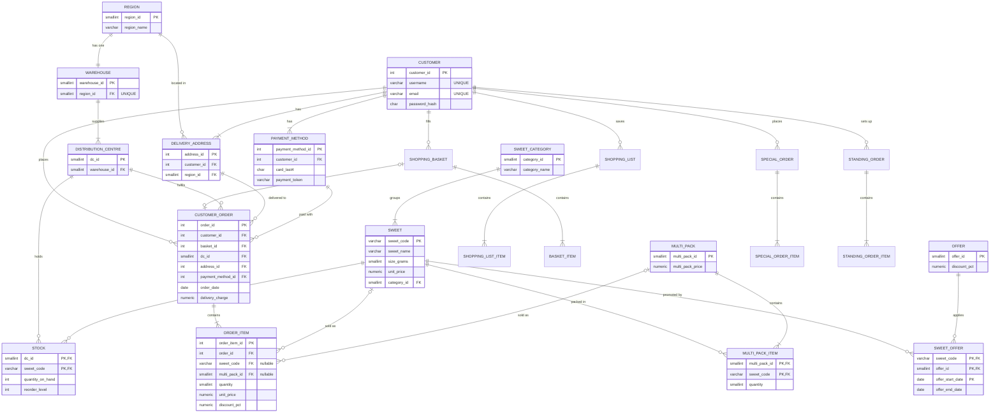

# Normalised schema (3NF) – entity relationship diagram

GitHub renders this Mermaid diagram automatically. The original hand-drawn conceptual ERD is in [`erd_original.jpg`](erd_original.jpg).

> `ORDER_ITEM`, `BASKET_ITEM`, `SHOPPING_LIST_ITEM`, `SPECIAL_ORDER_ITEM` and `STANDING_ORDER_ITEM` each reference **either** a sweet **or** a multi-pack, enforced with `CHECK (num_nonnulls(sweet_code, multi_pack_id) = 1)`.
